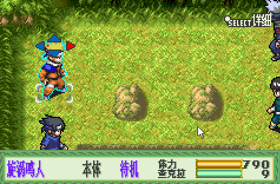

# 木叶战记续作

一款战棋游戏。

高中时期的一个小梦想。

《木叶战记》（原作）是一款GBA游戏。由于在制作时，火影忍者的动画并未完结，所以《木叶战记》的剧情截至中忍考试。

原作：

续作的性质为同人游戏，使用Unity制作。

最终build为PC和Android。

剧情段为：
火影忍者109话 音忍的邀约 - 134话 泪雨的结局

木叶战记吧开发记录贴：https://tieba.baidu.com/p/5118580229

视频演示：https://www.bilibili.com/video/av23773656

### 当前进度：

游戏整体框架基本建立，逐步由框架建设工作转换至剧情、战斗场景内容填充工作。

诚挚希望感兴趣的大神合作及指导！

QQ:1904057442

Q群:474538990

注：开源部分出于版权原因，不包含贴图模型等资源，请见谅。